AWS Console

\*\* By this point you should have received your credentials for logging
into AWS. An IAM user was created for you and you have completed the
initial setup of your IAM User.

POC Environment you will be working in:

The account name is: **(Refer to parameters URL)**

Rights granted: FULL ADMIN rights.

As long as you are only in this account, you are SAFE to play and
explore without concern of issues. You have the ability to use ALL AWS
services….. Enjoy!!!

**Prerequisite:**

You will have received an email with your temporary password and
information on how to change it. Please follow that information first.

    Start Here

**Step 1)** **Console Login**

The AWS console is a web based console that can be used to manage AWS
Services.

**TRY THIS**: You can access the account via the following:

(**Refer to parameters URL**)

**Step 2) Password Reset**

Sooner or later you will have to reset your password or someone else’s
password. Depending on the permission you have, you may only be able to
reset your own. At minimum you will always have permissions to reset
your password, create keys, and configure MFA. These are called User
Self Service.

To reset your password, you must be in the Auth account. This account is
the only account that actually has IAM Users, including your IAM user
you want to change the password to.

**TRY THIS: Change your password**

1) Login to the AWS Console,

   a. Click on this icon:

|image0|

a. In the search bar – type: **IAM** than hit Enter

b. On left pane, locate and click on ‘Users’

c. Locate your IAM User Name

1) Select Security Credentials

2) Search for “Console Password”

   a. Note: select ‘Custom Password’

   b. Change your password and hit “\ **Apply**\ ”

|image1|

    Once you have successfully changed your password, log out than log
    back in.

**Step 3) MFA Setup**

The Use of MFA is required and must be setup immediately upon creating
your account. Until you setup your MFA, you will not be able to do
anything other than just log into the Auth account. All your permissions
you have been granted will have been temporarily suspended.

Detailed information about using MFA can be found here:

https://docs.aws.amazon.com/IAM/latest/UserGuide/id_credentials_mfa_enable_virtual.html#enable-virt-mfa-for-iam-user

To setup the MFA:

**TRY THIS:**

1) Download your choice of Two-factor apps onto your Smart Phone

2) Locate your IAM User under the IAM Services page within the AWS
   Console

3) For your IAM User, locate “Assigned MFA Device” than select ‘manage’
   under Security Credentials.

4) Select ‘Virtual MFA’ – follow the instruction in the window.

5) There will be QR bar code that you can scan with a reader on your
   Two-factor app.

   a. This piece is not cover here since people should know how to do
      the two setup at their Two-factor device level since we have been
      using them for some time now.

6) Log out and then log back in. You will now be prompted for a MFA
   challenge in addition to your password.

**Step 4)** **Understanding the AWS Portal**

The AWS Web Portal is laid out in a ‘Box structure’. The boxes are:

1) AWS Services

2) Build a Solution

3) Learn to Build

Notice on the ‘AWS Service’ box there is a “SEARCH” icon, along with a
‘Recently Visited Services’ area. You will soon understand this area
will be your friend and the fastest and easiest way to navigate services
within AWS. 

**NOTE:** there is more than one way to get to the search function. Another easy way is to click on the "AWS" icon in the top left corner of your screen. If you are on any screen, clicking on that icon will bring up the search function.

AWS manages Users that log onto the AWS portal through a system called:
IAM Users. Additionally IAM groups, a set of IAM Users that are placed
into an IAM Group as a way to facilitate ease of management. These users
can be access via the IAM Services page within the Portal

**Step 5**) **List IAM Users and Groups**

**TRY THIS**: Using the information from **Step 2**, Navigate to the
service called “IAM”

Hint: the keyword for this service is: IAM - Remember Search is your
friend.

Now that you have successfully navigated to the IAM Service page. You
should see something like this: (Note: these are fictitious accounts)

|image2|

**TRY THIS: IAM Users and Groups **

**IAM Users:**

-  Navigate through IAM Users to see what you can understand.

-  Do you see your IAM User account?

-  What is the ARN of your IAM User?

   -  Amazon Resource Names (ARNs) uniquely identify AWS resources. 

   -  Format of an ARN:
      arn:aws:a4b:region:accountid:resourcetype/resource

-  Under Security Credentials: Does your IAM User have a managed MFA?

-  Under Permissions: How many policies does the user have?

   -  What types of policies are associated?

-  Does the IAM User have “Console” access?

   -  If yes, why, if no, why?

    **IAM Groups:**

-  Navigate through the IAM Groups to see what you understand.

-  What is the ARN of the IAM Group you are reviewing?

   -  Is it the same as the previous ARN? If not what is different?

-  How many IAM Users are in the Group?

-  Under Permissions: What Policies are specified?

**Step 6) Assuming Roles**

Immediately after you successfully login based off of step 1, you will
be in our auth account. This is the account that ALL IAM users are
created for ‘real users’. The IAM user you have been given will not be
allowed to directly log into other accounts. Instead you must use a
process called ‘Assume Role’.

This process is where your IAM User has been granted permission to
assume a role because your IAM user has been placed into an IAM Group
(Trusted Group). The IAM Role in which is attached via an inline policy
to your group allows you to assume the role based off the Trusting
Accounts (account you wish to go to) that the Role has been given
permission to assume.

**TRY THIS: Switching Roles**

Once you log into your AWS account. You will want to assume role to
another account.

1) At the TOP Right hand corner, Hit the drop down triangle as seen
   below.

|image3|

1) Select “Switch Role”

|image4|

1) The following screen will appear:

|image5|

Note: - You will be given the Account and Role information ahead of
time,

Note: - You do not have to populate the Display Name, this is not a
required field. However we suggest you do so next time you switch to
that same role you will have a ‘short cut’

Now that you have successfully Assumed Role into another account. It
would be beneficial to verify you are in the proper region.

**TRY THIS:** As you can see here, I am in the Oregon region which is
(US-West-2). If you are in any other region other than that, change to
this region by hitting the drop down.

**IMPORTANT NOTE**: There are a few services that are multi-regional,
therefore when you go to the service, it will state “Global” instead of
“Oregon” for an example.

A few of the popular services that are global are: IAM and S3.

|image6|

The REGION used within AWS. This is an important item to remember. As of
today we primarily use US-WEST-2 (Oregon). The URL above specifies the
region to log into.

**Self-Study reads**: Information on logging in can we found at this
site:
https://docs.aws.amazon.com/IAM/latest/UserGuide/getting-started_how-users-sign-in.html

**Step 7) S3 Service**

In this section you will see how to work with S3 via the console.
Although it is easy to manage a single S3 bucket from the console, it is
impractical to operationally manage MANY S3 buckets from the console
directly.  That said, using the console for this workshop will help with
understanding S3 concepts and use cases.

As mentioned before, S3 is a global service. That means it can be access
from any region. Another unique item about S3, every S3 bucket must be
uniquely named. No two S3 buckets can be named the same all through AWS.

**TRY THIS:** Accessing the S3 Service and list its content:

-  As mentioned in Step 4, you can use the ‘search’ function to get to
   S3. (**Hint** click on AWS icon on top left corner to access the search function)

   -  The keyword is **S3**

-  Listing S3 buckets:

   -  Once the S3 service window opens you will see a listing of all S3
      buckets currently created.

-  Listing the contents of a bucket:

   -  Click on any S3 bucket, if there is content in it, than a window
      will open with the names of the files or folders.

|image7|

Creating an S3 bucket is done in the same location as to where you list
the content.

**Step 8) Create a S3 Bucket**

**TRY THIS:** Log into S3 and create a S3 bucket

-  Select “Create Bucket”

-  Select a “unique name”

-  Place the S3 bucket into the “Oregon” region.

-  Keep all other items ‘default’ – next, next, create bucket

**Step 9) Upload a file to S3 via the console and viewing you newly
uploaded files.**

**TRY THIS**: Log into S3 and select your bucket.

-  Locate a local file you wish to send to your S3 bucket.

-  Select ‘Upload’

-  For the user and storage class, keep the defaults.

   -  The storage defaults will use the basic S3 tier.

   -  Permissions will be set to so the User and Group you are
      associated with will have access to the file.

-  Select ‘upload’ one final time – the file has now been uploaded.

-  Your new file will now been seen in the window that appears.

-  **NOTE:** Upload random non-confidential items up there. The more the
   better.

**Step 10) Download an object from S3 to your local computer**

Using a Browser, you can download items from a S3 Bucket to your local
PC. Depending on the amount of items, the data is downloaded into
multiple streams than combined back as one at the target.

**TRY THIS:**

-  To download an item from a S3 Bucket, you navigate to the S3 service
   page,

-  Locate the S3 Bucket you wish to pull data from.

-  Click on the Bucket Name

-  Locate the file(s) you wish to download to your PC, you have two ways
   to down them.

   -  Download – click on the file and select “download”

   -  Download as – Right Click the File and select ‘Save as’

**Step 11) Delete an object from a S3 Bucket**

As with all the other tasks done with S3, you will navigate to the S3
page. Once you have open the page a listing of current S3 buckets will
appear. In a previous step you have created a unique S3 bucket. This
bucket may still expendable data in it. Now you want to delete it since
it is no longer needed.

Before we delete, let’s take a quick look at the metadata of the Bucket.

**TRY THIS:**

-  put a check mark next to your Bucket, a new window should appear

|image8|

|image9|

-  Who owns the bucket?

-  Is versioning setup?

-  Is there Tags associated to the bucket?

Now that we have verified the S3 Bucket is the proper Bucket for
deletion, let’s start deleting the data in the S3 Bucket

**TRY THIS: **

**There are two options for deleting data from the console when it comes
to S3**

1. Pick and choose files to delete

2. Delete all data within the Bucket in one swoop.

**First we will pick and choose a file for deletion.**

-  Locate and click on the name of the S3 Bucket that has data in it
   that you want to

   Delete, a window with all the data inside the Bucket will open.

|image10|

-  Select the item you want to delete

-  Click on the “Actions” dropdown

-  Select ‘Delete”

|image11|

**Deleting ALL the data on a S3 bucket in one swoop.**

Deleting all the data in a S3 bucket that can be decommissioned is
pretty easy. It will just take the following steps:

-  Locate the S3 bucket

-  Place a checkmark next to it

-  Hit the “Empty” icon above

-  Verify you are Emptying the correct S3 Bucket by confirming the S3
   Bucket Name

-  Hit “confirm”

|image12|

-  How do you know the S3 Bucket is empty?

**Step 12) Delete the S3 Bucket **

**TRY THIS:**

-  Locate and place a checkmark next to the S3 Bucket you want to
   delete.

|image13|

-  Select Delete from the top of the page

|image14|

-  As a failsafe – AWS requires you to type the name of the S3 Bucket
   you actually intend to delete.

|image15|

-  Did the S3 Bucket really get deleted? (Hint: is it listed still with all the other S3 Buckets?)

-  How can you confirm? **Hint:** At bottom of screen click on 'success', on the window that pops up, click on the trash can. A verification of deletion is given.

**IMPORTANT NOTE:** When deleting an S3 bucket via AWS-CLI or SDK, you
are **REQUIRED** to empty the bucket before it allows you to delete the
bucket. The S3 console does not require the content to be deleted first.

**Step 13) Creating an EC2 Instance**

From the AWS Console we can make EC2 instances, these instances can be
used for many purposes. In this Section we will review the following
items.

-  Creating an EC2 instance

-  Creating and SSH keypair

-  Listing all the instances in the account

-  Logging into an instance you created (Linux)

-  Shutting down the instance

**Note: Before continuing on:**

**- VERIFY YOU ARE IN THE “AIT TRAINING” ACCOUNT **

**- Verify you are in US-WEST-2 (Oregon) Region.**

Creating an EC2 instance via the AWS console is fairly straightforward.
We will do it now…

**TRY THIS: **

-  Go to the EC2 Services page (keyword: EC2) – remember search is your
   friend.

-  Hit the BLUE (Launch Instance) button.

   -  Select “ **Amazon Linux 2 AMI (HVM), SSD Volume Type”**

-  Select t2 Micro

   -  Hit Next: Configure Instance Details

-  Under Networking – Select VPC: **(Refer to parameters URL)**

-  Under Subnet - Select Subnet: **(Refer to parameters URL)**

-  Auto-assign Public IP: **Select Enable**

   -  Hit Next: Add Storage

-  For storage – Click “Add Volume” – You will see it adds an 8GB EBS
   Volume.

   -  Hit Next: Add Tags

-  For Tags - Hit “Add Tag”

   -  Key = Name

   -  Value = put your name here EG: David-Rivera

   -  **Note: Refer to parameters URL**

   -  Hit Next: Configure Security Group

|image16|

-  Security Groups – Change to “Select an existing security group”

   -  Choose “\ **information given**\ ” security group

|image17|

Once you have selected the security group, questions:

-  What type of traffic is allowed

-  Is this setup safe, why?

-  What do you think a ‘security group’ is:

-  Review your configuration you have setup

   -  Hit “Review and Launch”

-  Create a key pair (**IMPORTANT:** **without this you can’t login to
   the EC2 instance)**

   -  Select “create a new key pair”

   -  Give it a name

   -  Hit “Download key pair” **NOTE**: **save to your computer**

|image18|

-  Hit **“Launch Instances”**

-  On the bottom right of page that opens hit **“View Instances”**

|image19|

-  View the EC2 instance booting up

|image20|

-  Once the EC2 instance fully boots up, you will see

|image21|

-  Locate the “Public IP Address” – write it down, we will now log into
   the server via putty.

In order to log into the EC2 instance you have created, you have to use
a key-pair that you previously saved. Since the majority of the people
will come in from a Windows PC. The natural SSH client to use is Putty.
The issue is Putty requires the key to be in PPK format, but AWS saves
it in PEM format. Using Putty Gen we will convert it and set it up.

**Step 14) Download – Putty Gen and Putty Client**

**TRY THIS: **

**Note: For Mac Users: you can use the native shell.**

**Use the command structure: ssh –i <pem key location>
ec2-user@public\_ip **

Download “Putty Gen” and “Putty” to your desktop

Can be found here:
https://www.chiark.greenend.org.uk/~sgtatham/putty/latest.html

**Step 15)** **Convert PEMS to PPK Key**

**TRY THIS:**

-  Start Putty Gen

-  Locate the PEM file that you saved when creating your EC2 instance

-  In Putty Gen, select “Load”

   -  Search for your PEM key (hint: change to “All Files”)

   -  Select “open”

-  This window should appear:

|image22|

-  Save your Private Key - Save it in a place on your desktop you can
   always remember how to access it.

   -  Note: passphrase is not required

|image23|

-  Close Putty Gen

Now that we have successfully converted the PEM key to PPK, let’s use it
to log into the EC2 instance now.

**Step 16) Logging into an EC2 Instance**

**TRY THIS: **

-  Open the “Putty Client”

-  Place your “Public IP” into the Hostname field

-  On the Left pane, Hit the “+” for SSH

-  Click on the word “Auth”

-  In the right pane, select browse and open your private key you saved
   to your desktop

|image24|

-  Hit “Open”

-  Login with user: **ec2-user **

|image25|

|image26|

Now that we have logged into the EC2 server and played around for a
while. It is now time for housekeeping. Before you end your labs, ensure
that you shut down the ec2 instance so we do not get charged for a
running instance.

**Step 17)** **Shutting down your EC2 Instance**

**TRY THIS:** To shut down the instance:

-  Navigate to the EC2 Instance page

-  Select your EC2 instance

-  Select “Actions”

-  Select "Instance State"

-  Select “Stop” (**Hint:** selecting “Terminate" would delete the instance.)

**You are Done!!!**

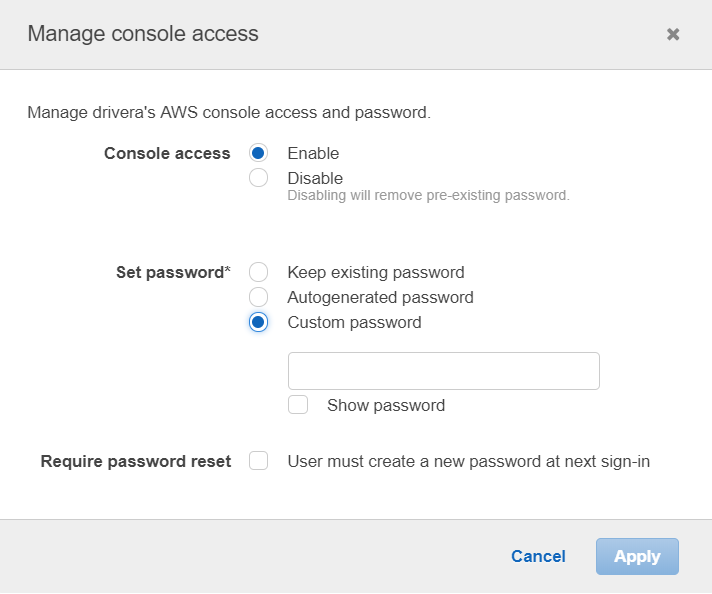
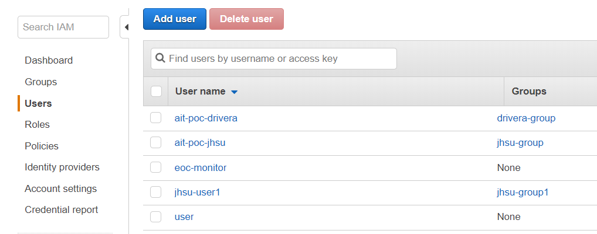
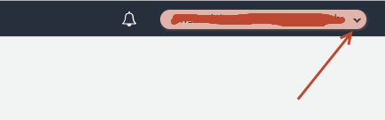
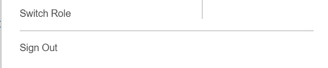
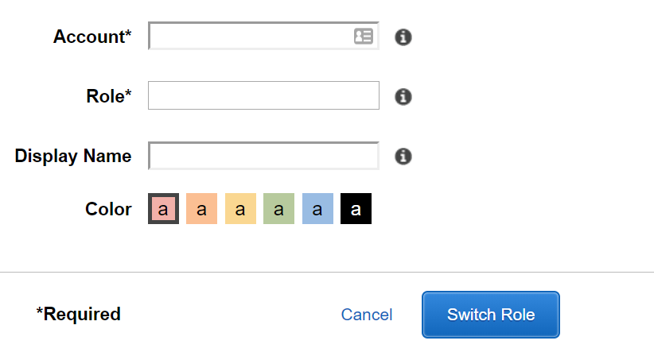
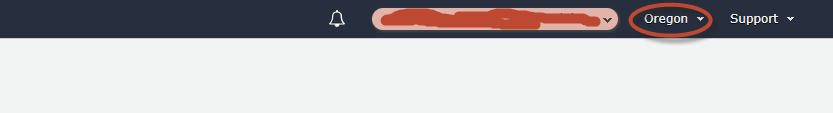
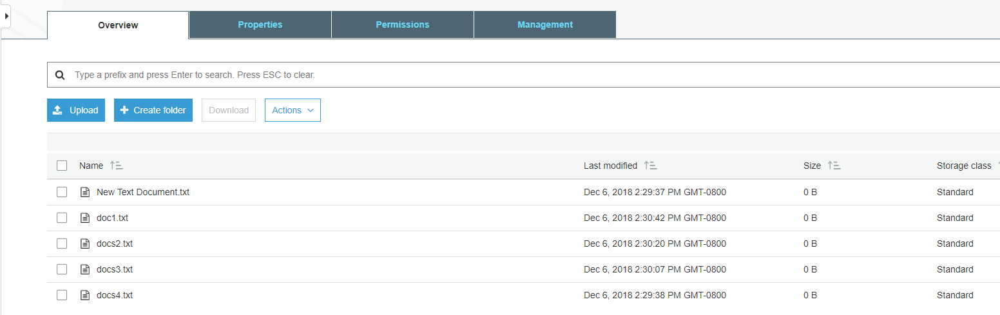

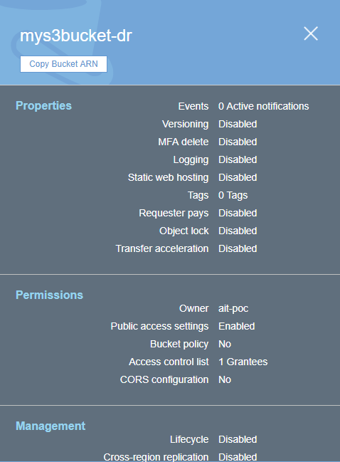
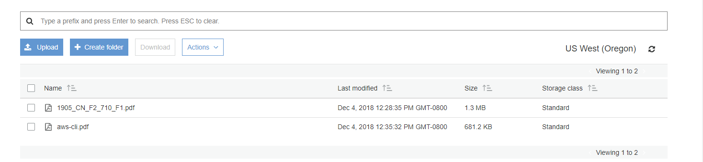
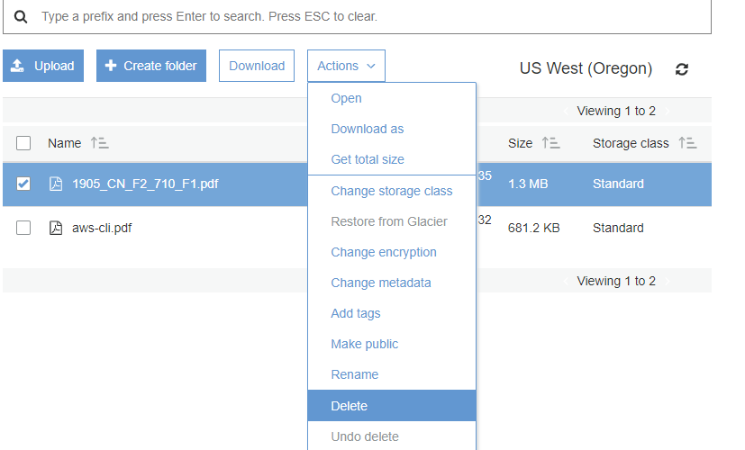
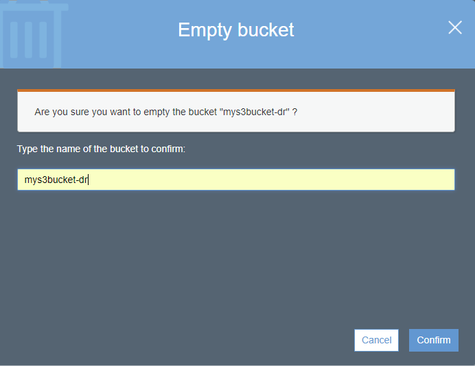

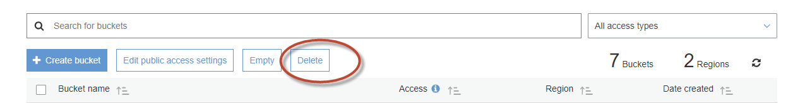
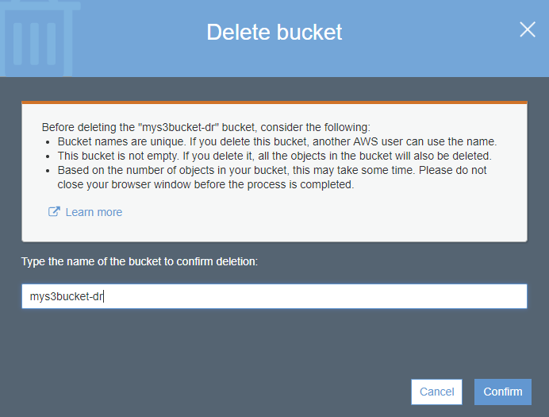
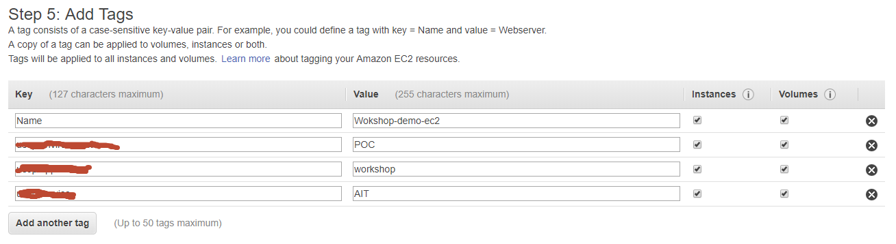
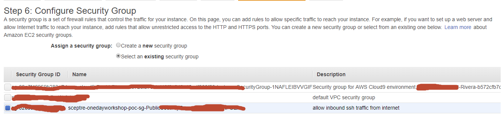
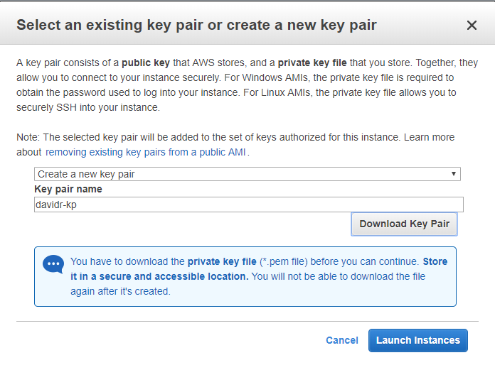

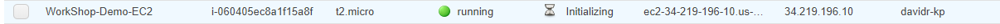
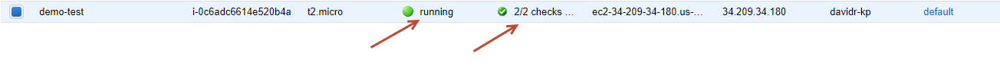
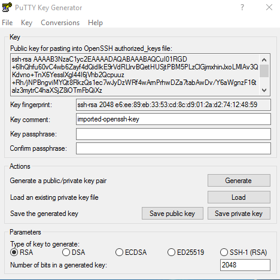
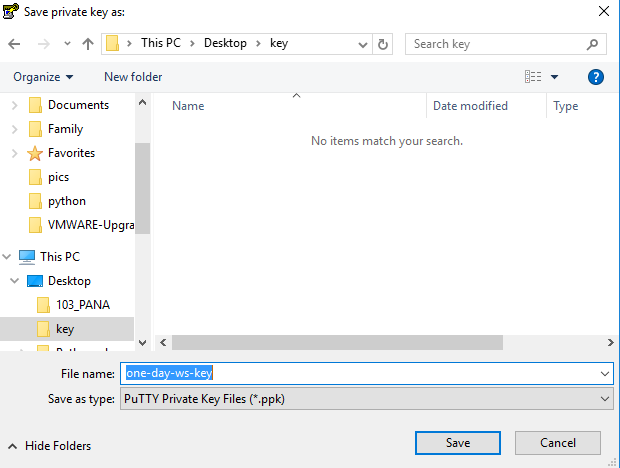
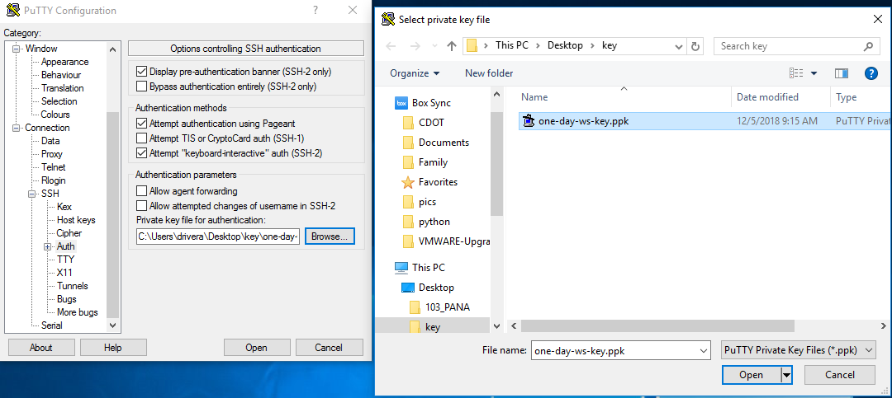
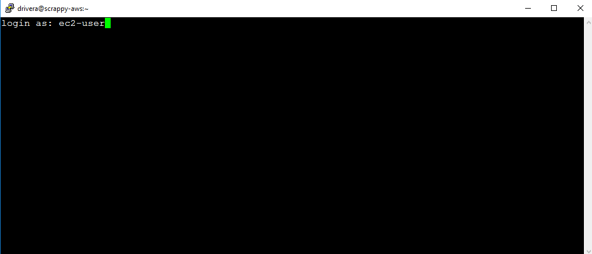
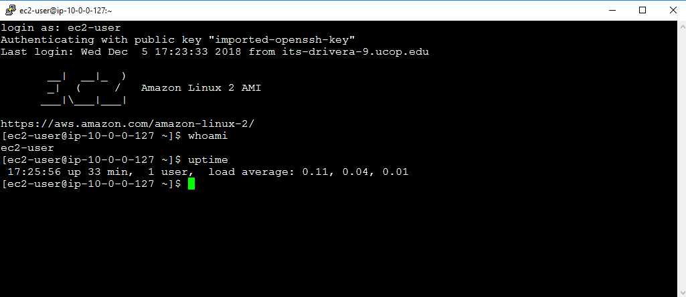
