CloudFormation via AWS Console

What is CloudFormation?

-  AWS CloudFormation is a service that gives developers and businesses
   an easy way to create a collection of related AWS resources and
   provision them in an orderly and predictable fashion

How can I interact with CloudFomration?

-  Currently you can interact with CloudFormation via the AWS Console
   and AWS CLI

Can I use AWS CloudFormation with Puppet?

-  Yes. AWS CloudFormation can be used to bootstrap both the Puppet
   Master and Puppet Client software on your EC2 instances. For more
   details and a how-to see \ `Integrating AWS CloudFormation with
   Puppet <https://s3.amazonaws.com/cloudformation-examples/IntegratingAWSCloudFormationWithPuppet.pdf>`__.

What new concepts does AWS CloudFormation introduce?

-  AWS CloudFormation introduces two concepts: The template, a JSON or
   YAML-format, text-based file that describes all the AWS resources you
   need to deploy to run your application and the stack, the set of AWS
   resources that are created and managed as a single unit when AWS
   CloudFormation instantiates a template.

Where can I get more information on CloudFormation?

-  https://aws.amazon.com/cloudformation/

    Getting Started

Managing CloudFormation with the AWS Console

**Workshop location**: the training account information will be provided
at the onset of the course.

**Workshop level of permissions**: You will have full administrator
privileges

When creating CloudFormation templates, you would have to decide on
which language you would like to write them in. The options are:

-  JSON - https://www.json.org/

-  YAML - http://yaml.org/

**JSON** – Also known as JavaScript Object Notation, it is a lightweight
data-interchange format. It is fairly easy to use.

**YAML** – (YAML Ain't Markup Language) - YAML is a human friendly data
serialization

standard for all programming languages. Since YAML is ‘human readable’
it is an easier language to pick up and just jump into the intricacies
of CloudFormation

**Prerequisites for CloudFormation**

**STOP: Before we start let’s make sure you have a KEY PAIR already in
this Account.**

If you can answer “yes” to ALL the questions below than skip this
section, if not continue on to with the prerequisites for this
lab\ **.**

**Questions:**

-  Did you do Lab 1 (working with AWS Console)?

-  Did you create and save that key pair for the EC2 instance you built?

-  Did you login successfully with the key pair you had to create?

**If you can answer YES to ALL the above questions, skip the
prerequisite section and move onto “Creating a CloudFormation stack with
“Design template”**

If no, continue on with of prerequisites below

**Creating a key pair **

-  Go to EC2 home page

-  On left pane search for “key pairs’, select it

-  Hit “Create Key Pair”

-  Save key pair to your desktop

**Creating a CloudFormation stack with “Design template”**

Using the design function within the AWS Console is one way a person can
create a CloudFormation template. It is marketed as an easy way to whip
up templates of CloudFormation stacks.

Within the design template, there are a few paths we could take.

Path 1 – import an existing template

Path 2 – create a template from scratch

We will be doing Path 1, future labs will give a hands on of path 2

Note: The template we will be using is located on a S3 Bucket and will
be referenced as part of the steps.

Let’s get started…

**Surprisingly the first place we need to start is in S3. We have to
download the CloudFormation template so we can make modifications to the
key name so it is unique to you**.

-  Locate the S3 service page – Hint: search for S3

-  Once you have made it to the page locate the S3 bucket named:
   (provided on separate page)

-  Go into that S3 Bucket.

-  Download the file called “cf-template.yml” to your desktop

**Updating the CloudFormation template to conform to your needs.**

We have to open the CloudFormation template and make a modification to
the key parameter so that it knows how to find your key pair.

-  The downloaded template called “cf-template.yml”

-  Open the file with **WordPad**

-  Search for: **ec2key**

-  You will see “david-kp” , replace with the name your key pair

-  **IMPORTANT:** Save file CloudFormation template as a new name

   -  EG: john-cf-template.yml

**NOTE: if you do not remember what you called your key**

-  Got to the EC2 page, search for “key Pairs” on the left pane window.

-  In the window that opens, the “Key Pair Name” is what you want.

**Upload your new template to the S3 bucket**

-  Once you have made the proper modifications and renamed the CF
   template, open the S3 Console page

-  Search got the S3 Bucket (bucket you originally took the master
   template from)

-  Upload your template to that bucket.

**Locate the AWS CloudFormation service page**

-  Assume role into training account

-  Using search menu – type: “cloudformation” and click on results

   -  The CloudFormation console will open.

|image0|

-  Click on the “\ **design template**\ ” button

|image1|

-  Upon opening the design template page, you will see this

|image2|

-  Now click on the folded paper icon and select “\ **open**\ ”

|image3|

-  When “\ **Open a template**\ ” window opens, select “\ **Amazon S3
   Bucket**\ ”

-  Select “\ **Template URL**\ ”

-  Input URL of S3 bucket (**NOTE: this information will be given in a
   separate paper**)

-  **NOTE: remember to use the template you uploaded to the S3
   Bucket!!!**

-  Hit “\ **Open**\ ”

**NOTE:** The picture below shows a SAMPLE S3 Bucket. Since Github is a
public site, we cannot use real locations in our documentations. The
format seen below is correct though.

-  Once you populate the “Template URL” hit “\ **Open**\ ”

|image4|

-  Now that you have hit “\ **Open**\ ”, the next window shows the
   population of resources that make up the CloudFormation template. As
   seen here:

|image5|

-  We should first VALIDATE that it is a good CloudFormation template

   -  To Validate hit the “check mark with a box around it”

   -  If the template comes back valid, then the initial checks AWS does
      have passed, thus allowing us to now create a stack.

**HINT:** **If you want to see the code, look at the lower pane window**

|image6|

-  The validation was successful!

   -  Let’s create a stack now from the CloudFormation template we have
      in our repository.

-  To create the stack we will hit the “half cloud with an up arrow”

   -  This will redirect us a new page.

-  On the “Select Template” page, review and hit next

   -  ***Notice: it prepopulated the “Specify an Amazon s3 template URL”
      field***

-  On the “Specify Details page: Add a stack name and review other info

   -  **Acceptable Stack Names:** Username-CF-Workshop

-  Hit “\ **Next**\ ”

Note: yes, I had to cross out sensitive information

|image7|

-  Under tags, hit the “+” sign and add the mentioned in the sheet hand
   out. You should have a total of 4 tags in place.

-  Note: The additional document will state the tag names

-  Hit “\ **Next**\ ”

|image8|

-  On next page, confirm and hit “\ **Create**\ ” button

-  Once you hit the “\ **Create**\ ” button, you will immediately be
   redirected to another page

|image9|

-  It is not a very complex stack so give it 20-30 seconds and hit the
   “Refresh” button on top right of screen, that you should see this:

|image10|

Now we want to make sure we can actually log into this fantastic Linux
EC2 Instance don’t we?

-  Go to the EC2 home page

-  Click on “\ **Instances**\ ”

-  You will now see a listing of all the EC2 instances. Locate yours

-  Once you find your EC2 instance, look for and jot down the
   “\ **Public IP**\ ”

Again sorry: had to black out lots of stuff – Github is public

    |image11|

    Let’s use putty make sure we can actually communicate with your EC2
    instance.

-  Open putty

-  Use the “\ **Public IP**\ ” you jot down

-  REMEMBER to add your key to putty

|image12|

-  Hit “\ **Open**\ ”

-  Login with user: ec2-user

|image13|

You did it!!!

You are done with part 1 of CloudFormation.

Part 2 will be using CloudFormation via AWS CLI

In Part 2, we will do this via the AWS CLI, we will make a working web
server.

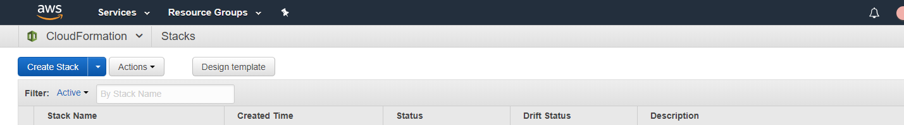
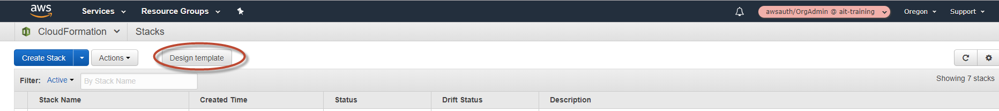
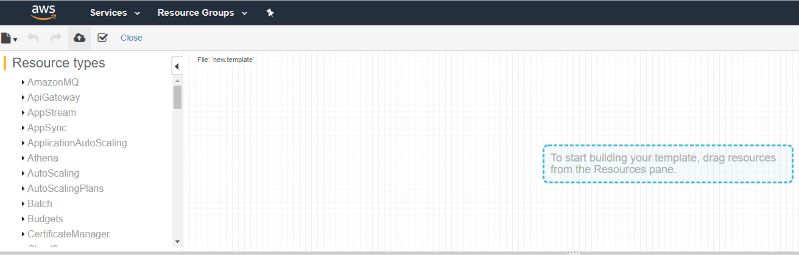
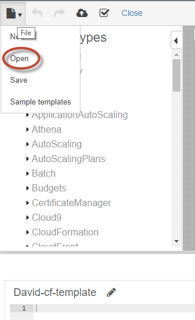
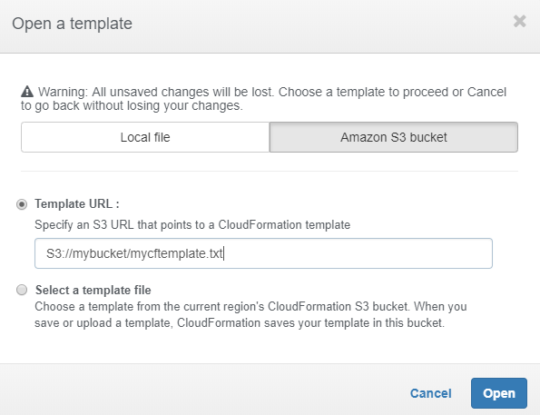
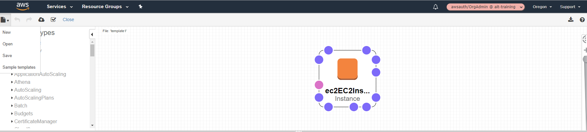
.. |image6| image:: cloudformation/media/image7.png
   :width: 6.50000in
   :height: 1.78958in
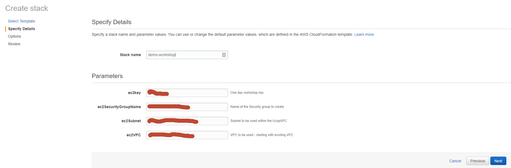
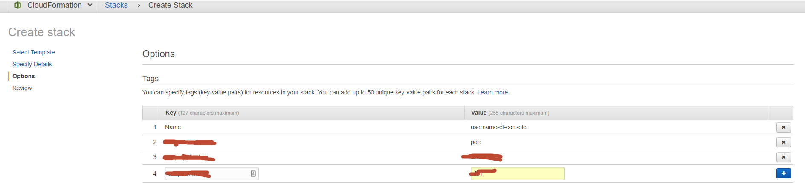
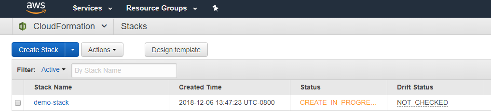
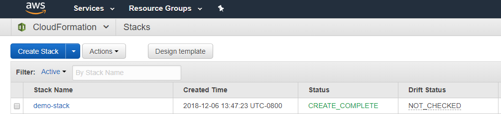
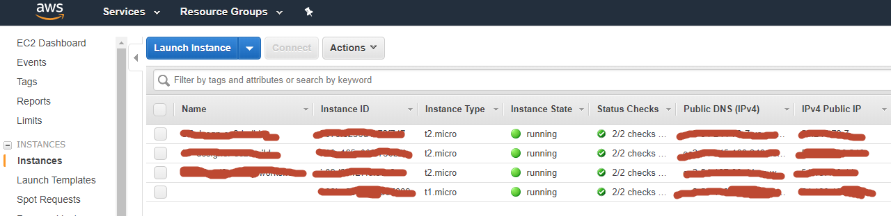
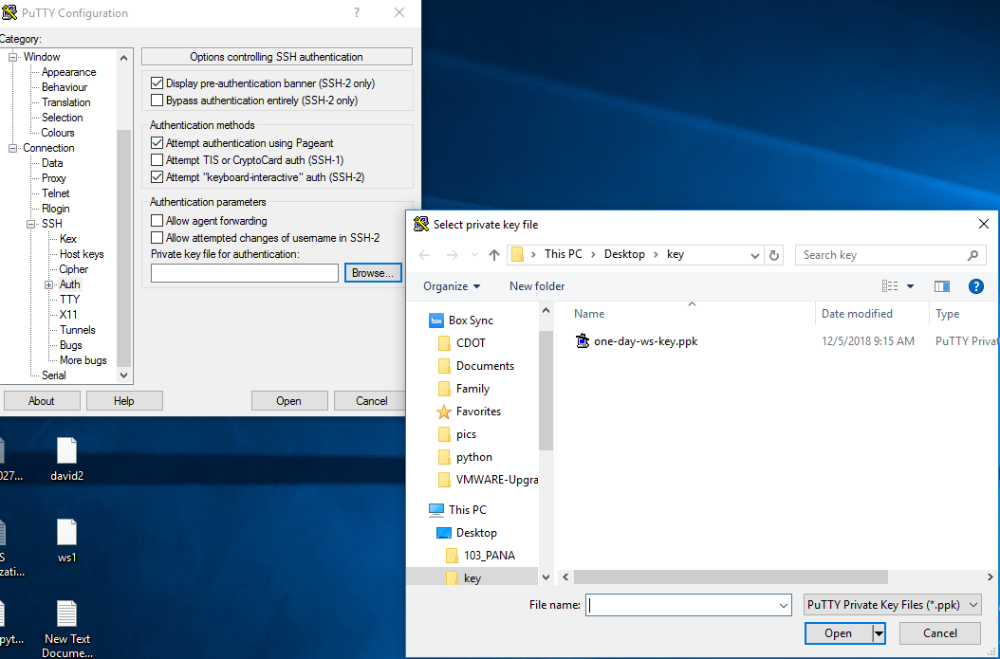
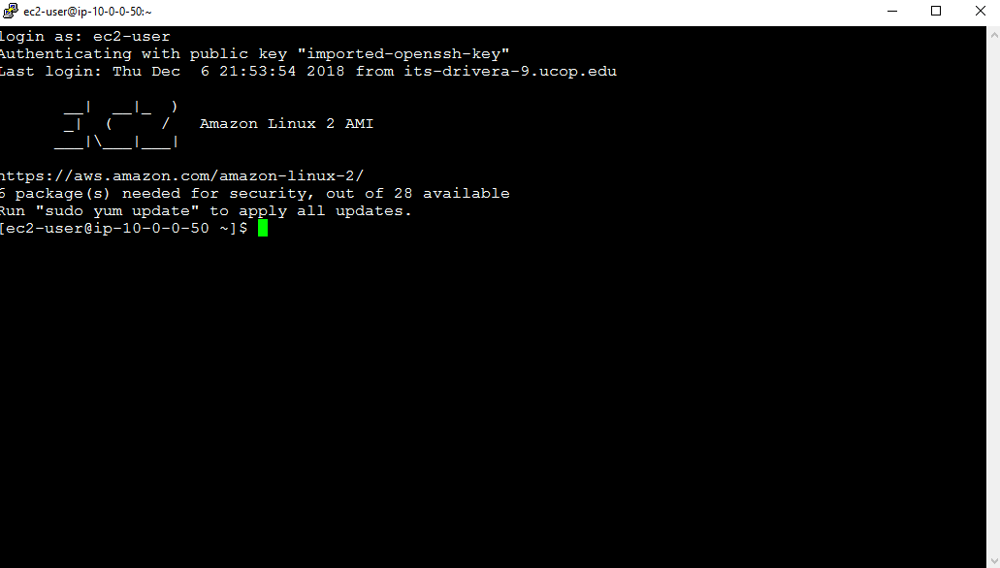
